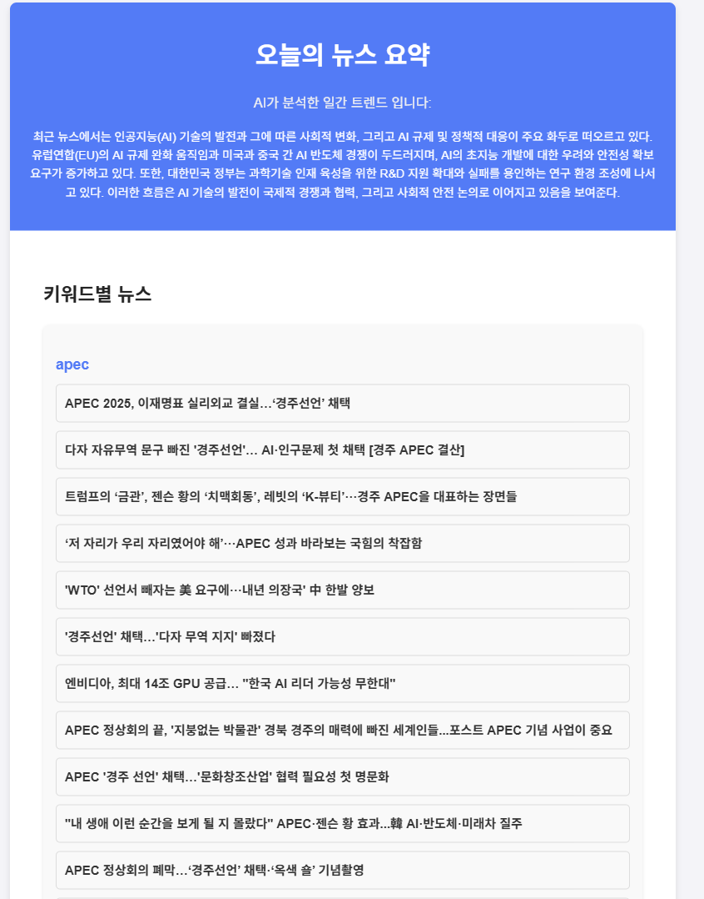
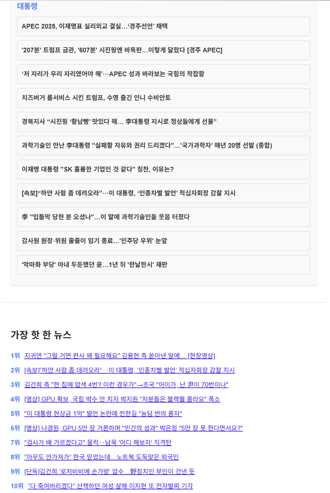
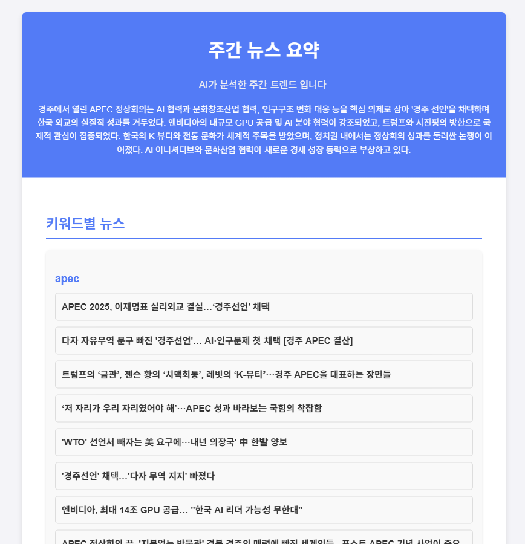
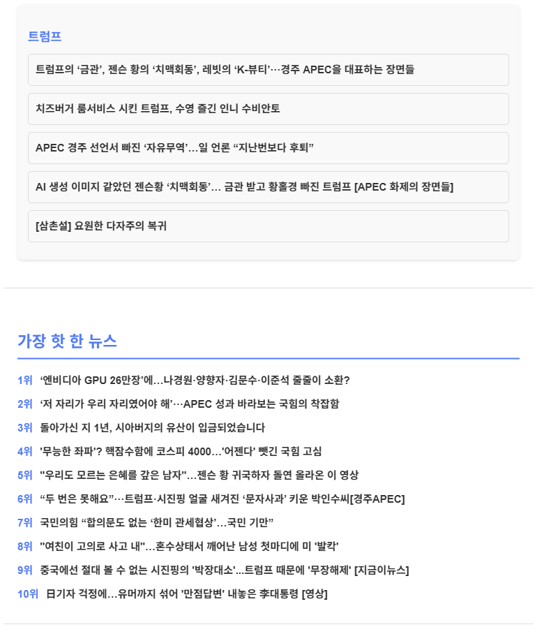

📰 뉴스 크롤러 & 트렌드 분석기 (Java Backend + Kafka)  

📌 프로젝트 소개  
뉴스 크롤러 & 트렌드 분석기는 Java(Spring Boot) 기반 웹 크롤링 시스템입니다.
  - Kafka를 활용해 URL 큐 관리 → 여러 Worker가 구독하여 뉴스 페이지 수집
  - 셀레니움 HTML 파싱 → 기사 제목, 본문, 링크 추출
  - Spring Scheduler로 주기적으로 새로운 뉴스 URL 큐 생성
  - 수집된 뉴스는 DB에 저장 후 NLP/TEXT RANK 기반 키워드 추출, 요약, 트렌드 분석
  - 뉴스 요약 및 관련 내용을 SMTP 활용한 이메일 전송
  - REST API로 데이터를 제공

📊 시스템 아키텍처

📌 뉴스 크롤링 및 키워드 추출
1. pring Scheduler를 활용하여 주기적으로 Kafka 토픽에 URL 메시지를 발행하는 Producer를 실행합니다. 
2. 여러 Worker는 Kafka 토픽을 구독하여 URL을 수신하고, 중복 방지를 위해 DEPTH 설정 및 Bloom Filter를 활용합니다. 
3. Worker는 수신한 URL에 대해 셀레니움을 사용하여 HTML을 파싱하고, 기사 제목, 본문, 링크 등의 데이터를 추출합니다. 
4. 추출된 기사는 DB에 저장되며, TF-IDF와 TextRank 알고리즘을 활용하여 키워드를 추출하고 저장합니다.

📌 RAG 패턴을 활용한 AI 뉴스 요약 및 트렌드 분석
1. 일간 단위로 수집된 뉴스 데이터를 LLM/Embedding 모델을 활용하여 요약문을 생성하고, 해당 요약문을 임베딩합니다. 
2. 생성된 임베딩은 PGVector DB에 저장됩니다. 일
3. 간/주간 단위로 사용자에게 메일을 발송하기 전, DB에서 가장 많이 사용된 키워드를 추출하여 이를 기반으로 LLM 프롬프트를 생성합니다.
4. 생성된 키워드 프롬프트를 활용하여 PGVector DB에서 벡터 검색을 통해 유사도가 높은 항목들을 검색하고, 검색된 요약문을 바탕으로 LLM을 통해 최종 뉴스 요약문을 생성합니다.
5. 최종적으로 생성된 뉴스 요약문은 사용자에게 이메일로 전송됩니다.

📊 일간 뉴스 실행 결과

📊 주간 뉴스 실행 결과

🚀 MVP 기능
1. 뉴스 기사 크롤링 기능
  - Kafka 기반 URL 큐 + Worker 구조
  - Spring Scheduler로 주기적 URL 발행
  - 뉴스 페이지 HTML 파싱 → 제목, 본문, 링크 추출
  1-1. 뉴스 기사 크롤링, 링크 검색
  - 링크만 모아서 재귀적 크롤링
    - 보통 메인에 주요기사들이있고 상세 기사 사이드쪽에 추천기사 등 사이드 기사들이 있음 
    - url 큐에 넣는 메인 에이전트는 메인에 주요 기사들을 추출해서 url을 카프카에 전송
    - 각 크롤러 워커들은 url 큐에서 url을 받고 메인기사, 댓글, 조회수 등 정보 추출을 하고 사이드에 기사들이있을경우
    - 사이드 기사들을 추출해서 url 큐에 다시 전송
    - Bloom Filter 및 depth를 설정하여 무한 크롤링 방지
    
2. 수집된 뉴스 저장 및 검색 API
  - DB에 기사 저장
  - 제목/키워드 기반 검색 REST API 제공

3. 뉴스 키워드 추출 및 빈도 분석
  - TF-IDF + TextRank 기반 키워드 추출
  - 일간 / 주간 키워드 발생 빈도를 활용하여 트렌드 분석

4. 키워드 API 제공
  - 일간 / 주간 키워드 조회
  - REST API 제공

5. 키워드 기반 / 인기있는 뉴스 요약 API
  - 특정 키워드 관련 기사 요약 제공
  - JSON 형태 반환

6. LLM - RAG - LANGCHAIN 활용한 주간 뉴스 트렌드 분석 및 요약
  - 주간 뉴스 데이터 수집 후 LLM을 활용한 트렌드 분석
  - 주요 이슈 요약 생성
  - 뉴스 데이터 수집 - LLM을 활용한 본문 내용 요약 - 요약본에 대한 임배딩 생성 - 프롬포트 내용 기반 임베딩 검색 - RAG 기반 뉴스 요약 및 트렌드 분석
  - 키워드별 뉴스 요약이 아닌 주간/일간 뉴스 요약으로 진행(단순 키워드로 임베딩 검색의 의미가 없음 전체 상위 5개 키워드를 활용해서 문장화 이후 해당 프롬포트를 활용해서 임베딩 검색)

🛠 기술 스택
  - 언어 : Java 21
  - 프레임워크 : Spring Boot
  - AI: SPRING AI, Langchain, OpenAI API
  - 웹 크롤링 : SELENIUM
  - 스케줄링 : Spring Scheduler (@Scheduled)
  - DB : Pgvector, PostgreSQL
  - 빌드 툴 : Gradle

📌 역할 정리

1️⃣ 메인 서버 (URL Producer)
  - 특정 사이트의 초기 URL(seed URL)에서 첫 페이지 HTML을 요청
  - HTML에서 페이지 내 링크를 추출
  - 새 뉴스 페이지 URL, 관련 기사 URL 등
  - 추출한 URL을 Kafka 토픽에 메시지로 발행
  - 주기적으로 실행 가능 (Spring Scheduler 사용)

2️⃣ 워커 (Worker / URL Consumer)
  - Kafka 토픽을 구독 → 메시지(URL) 수신 받은 URL에 대해 두 가지 작업 중 하나 수행
    1. 링크 검사 / 추가 탐색
      - 해당 페이지에 또 다른 링크가 있는지 확인
      - 새로운 URL이 있으면 Kafka에 다시 발행 → 재귀적 크롤링
    2. 데이터 추출 (스크래핑)
      - 기사 제목, 본문, 날짜, 이미지 등 필요한 데이터 수집
  - 워커는 이 과정을 반복 → 큐에서 다음 URL 가져오기 → 크롤링 지속

3️⃣ AI
  - 임베딩을 활용한 백터 검색
  - RAG 패턴을 활용한 뉴스 요약
  - 키워드 추출 및 트렌드 분석